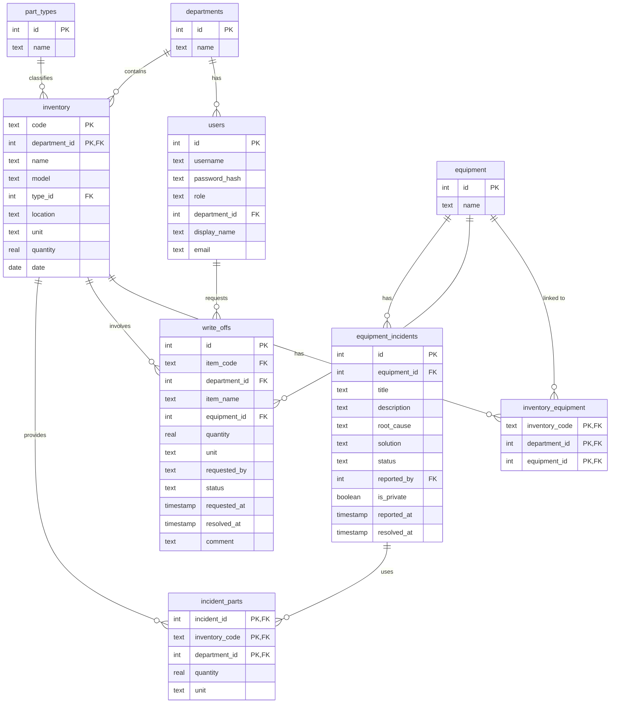

# 📦 Warehouse – Electronics Inventory Management System

A lightweight, self-hosted web application for managing electronic components inventory. Track parts, record write-offs, handle user roles, scan barcodes, and import/export data from Excel or CSV. Built with Node.js, Express, SQLite and vanilla JavaScript.


## ✨ Features

- **Inventory Management** – Add, edit, delete parts with metadata (code, name, model, type, equipment, location, unit, quantity, min. stock).
- **Write‑Off Requests** – Employees can submit write‑off requests; admins approve or reject them.
- **Role‑Based Access** – Three roles (`admin`, `moderator`, `viewer`) with different permissions.
- **Barcode Scanner** – Use the device camera to scan barcodes and instantly find items (mobile-friendly).
- **Import & Export** – Import data from Excel (.xlsx) or CSV files; export filtered inventory to Excel or CSV.
- **Bulk Editing** – Select multiple items and update type, equipment or location in one action.
- **Change History** – Every modification of an item is logged (old/new values, author, timestamp).
- **Low‑Stock Alerts** – Set minimum quantity per item; items below that threshold are highlighted and can be filtered.
- **Attachment Support** – Attach images to inventory items (e.g., photos of labels or storage locations).
- **Reports** – Visual analytics for write‑offs (charts by month, equipment, top items) and turnover statements.
- **Backup & Restore** – Download a database backup or upload a previously saved backup directly from the admin interface.
- **Responsive Design** – Fully usable on desktops, tablets and phones.

## 🛠️ Tech Stack

- **Backend:** Node.js, Express, SQLite (via `better-sqlite3`), JWT authentication, `multer` for file uploads.
- **Frontend:** Vanilla HTML, CSS (custom properties, grid/flexbox), JavaScript (modular, no framework).
- **Libraries:** SheetJS (xlsx) for Excel handling, `html5-qrcode` for barcode scanning, Chart.js for reports.
- **Security:** Content Security Policy (CSP), JWT with configurable expiration, HTTPS ready, input sanitisation.


## 📁 Структура проекта
``` text
warehouse/
├── public/ # Static frontend files
│ ├── index.html # Main inventory page
│ ├── writeoff.html # Write‑off request form
| ├── admin.html # Directories management (types, equipment)
│ ├── admin-writeoffs.html # Admin panel for write‑offs & reports
│ ├── css/
│ │ ├── base.css
│ │ ├── layout.css
│ │ ├── components.css
│ │ ├── utilities.css
│ │ └── mobile.css
│ ├── js/
│ │ ├── api.js, auth.js, filters.js, ui.js, modals.js, ...
│ │ └── xlsx.full.min.js, html5-qrcode.min.js, chart.min.js
│ └── uploads/ # Uploaded attachments
├── server/
│ ├── server.js # Express app entry point
│ ├── db.js # Database setup, migrations
│ ├── middleware/
│ │ └── auth.js # JWT verification, role checks
│ ├── routes/
│ │ ├── inventory.js # CRUD, import, export, history
│ │ ├── auth.js # Login, token verification
│ │ ├── writeoffs.js # Write‑off requests & reports
│ │ └── directories.js # Part types, equipment CRUD
├── package.json
├── TODO.md # Roadmap and planned features
└── README.md
```

## 🚀 Getting Started

### Prerequisites
- Node.js (v16 or later)
- npm
- (Optional) Git

### Installation

1. **Clone the repository**
   ```bash
   -git clone https://github.com/yourusername/warehouse.git
   -cd warehouse
   
2. **Install dependencies**
   ```bash
   -npm install

3. **Set environment variables (optional but recommended)**
   Create a .env file in the root directory:
   ```text
   -PORT=3000
   -JWT_SECRET=your_very_long_random_secret
 If JWT_SECRET is not set, a default secret is used (change it in production).

4. **Run the server**
   ```bash
   -npm start
  The app will be available at http://localhost:3000.

## 🔐 Security
- **JWT Authentication** – Tokens expire after 12 hours by default; all API endpoints (except write‑off submission and public data) require a valid token.
- **Role‑Based Access Control** – Each route verifies the user’s role (admin, moderator, viewer) before allowing write operations.
- **Content Security Policy** – Strict CSP header is applied to prevent XSS; external scripts (like CDN libraries) are allowed only from trusted sources (or served locally).
- **Input Sanitisation** – All user‑supplied data is escaped before rendering in the DOM.
- **Session Timeout** – Automatic logout after 5 minutes of inactivity (client‑side timer).
- **Backup Encryption** – Database backups can be downloaded and restored manually; store them securely.

## 📈 Usage
### Main Inventory Page (/)
- **Search & Filter** – Search by code, name or model; filter by part type or equipment.
- **Add / Edit** – Click the add button or select a row and click edit. Fill in the form (code, name, type, quantity, etc.).
- **Bulk Actions** – Select multiple checkboxes, then choose an action from the dropdown (change type, equipment, location).
- **Import** – Upload an Excel or CSV file. The first row must contain column headers (see sample files).
- **Export** – Export the currently visible (filtered) list to Excel or CSV.
  
### Write‑Off Requests (/writeoff.html)
- Search for an item, select it, specify quantity, equipment and optionally a comment.
- The request appears in the admin panel with status “pending”.

### Administration
- **Directories** (/admin.html) – Manage part types and equipment lists.
- **Write‑Off Management** (/admin-writeoffs.html) – Approve/reject requests, view reports with charts.
- **User Management** – (Coming soon) Create and manage user accounts.

## 🧪 Development & Contributing
Contributions are welcome! Please see the TODO.md for a list of planned features and known issues.
1. Fork the repository
2. Create a feature branch (git checkout -b feature/awesome-feature)
3. Commit your changes (git commit -m 'Add awesome feature')
4. Push to the branch (git push origin feature/awesome-feature)
5. Open a Pull Request

For major changes, please open an issue first to discuss what you would like to change.

## 📄 License
This project is licensed under the MIT License. See the LICENSE file for details.


